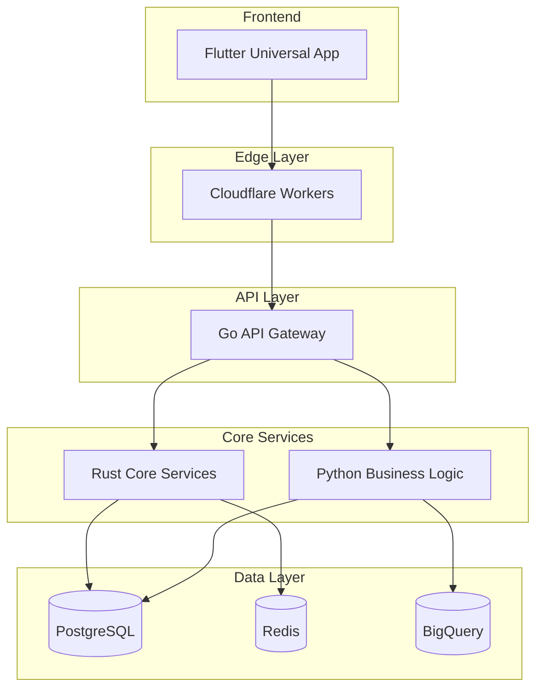

# 🌩️ Olympus Cloud GCP - Next Generation Cloud Business AI OS

[]()
[]()
[]()
[]()

> **Building technology that adapts to humans, not the other way around**

## 🚀 Quick Start

```bash
# Clone the repository
git clone https://github.com/olympuscloud/olympus-cloud-gcp.git
cd olympus-cloud-gcp

# Install dependencies
make install-all

# Setup development environment
make setup-dev

# Run everything locally
make dev

# Access services
# API: http://localhost:8080
# Frontend: http://localhost:3000
# PostgreSQL: localhost:5432
# Redis: localhost:6379
```

## 📖 Documentation

Start here → [**Executive Summary & Roadmap**](docs/00-EXECUTIVE-SUMMARY-ROADMAP.md)

### Essential Guides
- [Master Implementation Guide](docs/01-MASTER-IMPLEMENTATION-GUIDE.md)
- [AI Agent Task Assignments](docs/02-AI-AGENT-TASK-ASSIGNMENTS.md)
- [NebusAI Methodology](docs/03-NEBUSAI-METHODOLOGY-IMPLEMENTATION.md)
- [Quick Start Guide](docs/04-QUICK-START-GUIDE.md)
- [Database Schema](docs/05-COMPLETE-DATABASE-SCHEMA.sql)
- [API Specification](docs/06-API-SPECIFICATION.yaml)
- [Deployment Guide](docs/07-DEPLOYMENT-GUIDE.md)

## 🏗️ Architecture



## 🎯 Key Features

### For Businesses
- 🏪 **Multi-Industry Support**: Restaurant, Retail, Salon, Hospitality, Events
- 💰 **Complete Commerce**: Orders, Payments, Inventory, Supply Chain
- 👥 **Customer Experience**: CRM, Loyalty, Marketing, Analytics
- 👨‍💼 **Workforce Management**: Scheduling, Time Tracking, Payroll
- 📊 **Business Intelligence**: Real-time Analytics, Predictive Insights

### For Developers
- 🏗️ **Modular Monolith**: Simple deployment, better performance
- 🦀 **Rust Core**: Memory-safe, blazing fast
- 🚀 **Go API Gateway**: Excellent concurrency
- 🐍 **Python AI/ML**: Rich ecosystem
- 🎨 **Flutter Universal**: One codebase, all platforms

### For Users
- 🗣️ **Natural Language Interface**: Speak or type naturally
- 🧠 **Context-Aware UI**: Adapts to your workflow
- 📱 **All Platforms**: iOS, Android, Web, Desktop, Watches
- ⚡ **Lightning Fast**: <50ms response globally
- 🔐 **Enterprise Security**: Zero-trust, encrypted, compliant

## 👥 AI Agent Development Teams

| Agent | Role | Contact | Status |
|-------|------|---------|--------|
| Claude Code | Rust & Architecture | `/backend/rust/` | 🟢 Ready |
| GitHub Copilot | Flutter UI | `/frontend/` | 🟢 Ready |
| Google Gemini | Infrastructure | `/infrastructure/` | 🟢 Ready |
| OpenAI Codex | Python Logic | `/backend/python/` | 🟢 Ready |
| ChatGPT | Go API | `/backend/go/` | 🟢 Ready |

## 📊 Project Status

### Phase 1: Foundation (Weeks 1-4)
- [x] Architecture Design
- [x] Documentation
- [ ] GCP Setup
- [ ] Database Implementation
- [ ] Auth Service
- [ ] API Gateway
- [ ] Flutter Skeleton
- [ ] CI/CD Pipeline

### Current Sprint
- **Sprint**: 1 of 12
- **Focus**: Foundation & Authentication
- **Due Date**: 2 weeks from start

## 🛠️ Technology Stack

### Backend
- **Core Services**: Rust 1.75+
- **API Gateway**: Go 1.21+
- **Business Logic**: Python 3.11+
- **Database**: PostgreSQL 15
- **Cache**: Redis 7
- **Analytics**: BigQuery

### Frontend
- **Framework**: Flutter 3.16+
- **State Management**: Riverpod
- **Navigation**: GoRouter
- **HTTP Client**: Dio

### Infrastructure
- **Cloud**: Google Cloud Platform
- **Edge**: Cloudflare Workers
- **Container**: Cloud Run
- **IaC**: Terraform
- **CI/CD**: GitHub Actions

## 🚦 Development Workflow

### Local Development
```bash
# Start all services
make dev

# Run tests
make test

# Format code
make fmt

# Lint code
make lint

# Build all
make build
```

### Git Workflow
```bash
# Create feature branch
git checkout -b feat/your-feature

# Commit with conventional commits
git commit -m "feat(module): add new feature"

# Push and create PR
git push origin feat/your-feature
gh pr create
```

## 📈 Metrics & Goals

### Technical Metrics
- ⚡ API Response: <100ms (p99)
- 🔄 Deployment: <10 minutes
- ✅ Test Coverage: >80%
- 🛡️ Security: 0 vulnerabilities

### Business Goals
- 💰 Infrastructure Cost: 50% reduction
- 🚀 Time to Market: 24 weeks
- 😊 User Satisfaction: >4.5/5
- 📈 Development Velocity: 10x

## 🤝 Contributing

Please read [CONTRIBUTING.md](CONTRIBUTING.md) for our development process.

### Commit Convention
```
feat: New feature
fix: Bug fix
docs: Documentation
test: Testing
chore: Maintenance
```

### Code Review Process
1. Create feature branch
2. Write tests first
3. Implement feature
4. Update documentation
5. Create pull request
6. Pass CI/CD checks
7. Get review approval
8. Merge to main

## 📄 License

This project is proprietary software owned by NebusAI Corporation.

## 🆘 Support

- Documentation: [/docs](./docs)
- Issues: [GitHub Issues](https://github.com/olympuscloud/olympus-cloud-gcp/issues)
- Email: support@nebusai.com
- Website: [nebusai.com](https://nebusai.com)

## 🌟 Acknowledgments

Built with ❤️ by the NebusAI team and AI coding agents.

---

**"The future of software isn't about teaching humans to think like computers. It's about building computers that understand humans."** - Scott W Houghton, NebusAI

---

## 🏁 Start Building Now!

```bash
# For Claude Code (Rust)
cd backend/rust && cargo build

# For GitHub Copilot (Flutter)
cd frontend && flutter run

# For Google Gemini (Infrastructure)
cd infrastructure/terraform && terraform init

# For OpenAI Codex (Python)
cd backend/python && pip install -r requirements.txt

# For ChatGPT (Go)
cd backend/go && go mod download
```

**The revolution starts now. Let's build something extraordinary together! 🚀**