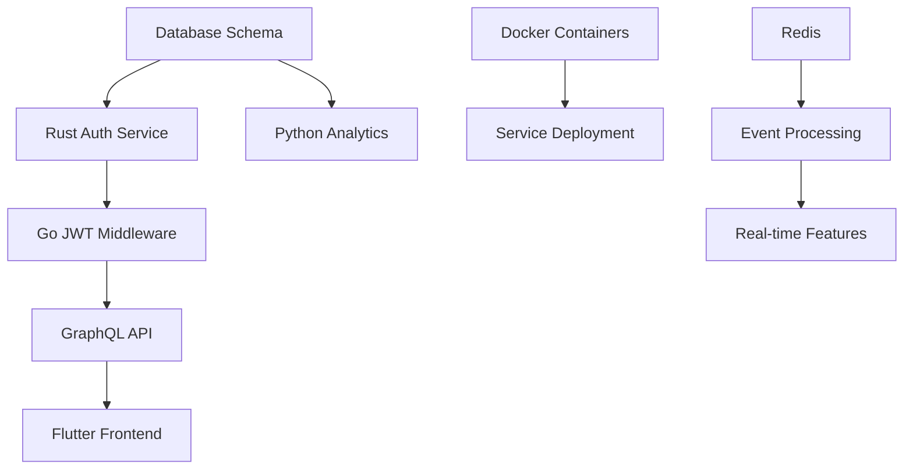

# 🤝 AI Agent Coordination Status

> **Updated:** 2025-01-18 | **Branch:** demo/minimal-backend

## 📊 Overall Project Status

| Metric | Status | Progress | Target |
|--------|---------|----------|---------|
| **Overall Completion** | 🟡 Foundation | 20% | 100% (3 weeks) |
| **Backend Services** | 🔴 Critical | 15% | 80% (2 weeks) |
| **Infrastructure** | 🟡 Partial | 60% | 90% (2 weeks) |
| **Frontend** | 🔴 Missing | 5% | 70% (1 week) |
| **Integration** | 🔴 None | 0% | 95% (3 weeks) |

## 🎯 Current Sprint Focus (Week 1)

### 🚨 Critical Path Items
1. **Database Schema Implementation** (Claude Code) - BLOCKING ALL
2. **Container Infrastructure** (Google Gemini) - BLOCKING DEPLOYMENT
3. **Authentication Service** (Claude Code) - BLOCKING API ACCESS
4. **JWT Middleware** (ChatGPT) - BLOCKING API GATEWAY

### 📋 Agent-Specific Status

#### Claude Code - Rust Core Services
**Current Task:** Database Foundation & Authentication
- [ ] **IN PROGRESS:** Database schema creation
- [ ] **PENDING:** Authentication service implementation
- [ ] **PENDING:** Platform service development
- [ ] **PENDING:** Commerce service development

**Blockers:** None
**Dependencies:** PostgreSQL deployment (Google Gemini)
**Timeline:** 3-4 days for auth completion

#### Google Gemini - Infrastructure
**Current Task:** Container Infrastructure & Database
- [ ] **IN PROGRESS:** Docker container creation
- [ ] **IN PROGRESS:** PostgreSQL deployment
- [ ] **PENDING:** Redis deployment
- [ ] **PENDING:** CI/CD pipeline setup

**Blockers:** None
**Dependencies:** None
**Timeline:** 2-3 days for basic infrastructure

#### ChatGPT - Go API Gateway
**Current Task:** Basic Gateway & JWT Integration
- [ ] **IN PROGRESS:** Project structure setup
- [ ] **PENDING:** JWT middleware implementation
- [ ] **PENDING:** GraphQL implementation
- [ ] **PENDING:** Service proxy layer

**Blockers:** Waiting for Rust auth service
**Dependencies:** JWT tokens from Claude Code
**Timeline:** 2-3 days after auth service ready

#### OpenAI Codex - Python Analytics
**Current Task:** Industry Modules Expansion
- [x] **COMPLETED:** Retail analytics & promotions engine
- [ ] **IN PROGRESS:** Hospitality analytics foundation
- [ ] **PENDING:** Events analytics design
- [ ] **PENDING:** NLP intent enhancements

**Blockers:** None (ready for further integrations)
**Dependencies:** Coordination with Go API for retail endpoint rollout
**Timeline:** 2-3 days to deliver hospitality & events modules

#### GitHub Copilot - Flutter Frontend
**Current Task:** Not yet started
- [ ] **PENDING:** Project initialization
- [ ] **PENDING:** API integration planning
- [ ] **PENDING:** UI/UX development
- [ ] **PENDING:** Real-time features

**Blockers:** Waiting for API endpoints
**Dependencies:** Go API Gateway (ChatGPT)
**Timeline:** Can start basic structure immediately

## 🔄 Integration Dependencies

## 📅 Weekly Milestones

### Week 1 Goals (Days 1-7)
- [ ] **Database schema deployed and accessible**
- [ ] **All services containerized and running locally**
- [ ] **Authentication service functional with JWT**
- [ ] **API Gateway routing requests correctly**
- [ ] **Basic analytics collecting events**

### Week 2 Goals (Days 8-14)
- [ ] **Complete business logic in all Rust services**
- [ ] **GraphQL API fully functional**
- [ ] **Real-time features working via WebSocket**
- [ ] **ML models deployed and serving recommendations**
- [ ] **Flutter app showing basic data**

### Week 3 Goals (Days 15-21)
- [ ] **Production deployment operational**
- [ ] **End-to-end user workflows working**
- [ ] **Performance targets met**
- [ ] **Security audit passed**
- [ ] **Documentation complete**

## 🚨 Risk Assessment

### High Risk Items
1. **Database Schema Complexity** - Multiple agents need coordination
2. **Service Communication** - HTTP clients and error handling
3. **Authentication Integration** - Cross-service JWT validation
4. **Real-time Features** - WebSocket + Redis coordination

### Medium Risk Items
1. **Performance Requirements** - Sub-100ms response times
2. **Multi-tenant Security** - Row-level security implementation
3. **ML Model Training** - Data availability and model accuracy
4. **Cross-platform Frontend** - Flutter deployment complexity

### Low Risk Items
1. **Infrastructure Automation** - Terraform is well-documented
2. **Basic CRUD Operations** - Standard patterns
3. **Monitoring Setup** - GCP native tools
4. **Documentation** - Can be done in parallel

## 🔧 Daily Coordination Protocol

### Morning Standup (All Agents)
1. **Check status documents:**
   - `docs/BACKEND-STATUS.md`
   - `docs/INFRASTRUCTURE-STATUS.md`
   - `docs/COORDINATION-STATUS.md` (this file)

2. **Update your task list:**
   - Mark completed tasks
   - Add any new blockers
   - Update timeline estimates

3. **Review dependencies:**
   - Check if any dependencies are ready
   - Notify other agents of your completions
   - Plan integration testing

### Development Standards
1. **Commit Messages:** Use conventional commits (feat:, fix:, docs:)
2. **Testing:** Write tests for all new functionality
3. **Documentation:** Update API docs for any changes
4. **Security:** Follow security best practices
5. **Performance:** Monitor response times and resource usage

### Communication Channels
- **Task Updates:** Update individual task files
- **Blockers:** Document in this coordination file
- **Architecture Decisions:** Update master implementation guide
- **API Changes:** Update API specification document

## 📈 Success Metrics

### Technical Metrics (Target by Week 3)
- [ ] API response time < 100ms (p99)
- [ ] Database query time < 50ms (p99)
- [ ] Container startup time < 30s
- [ ] Unit test coverage > 80%
- [ ] Integration test coverage > 70%
- [ ] Security scan - zero critical vulnerabilities

### Business Metrics (Target by Week 3)
- [ ] User registration and login working
- [ ] Product catalog browsing functional
- [ ] Order creation and management working
- [ ] Real-time analytics dashboard operational
- [ ] Multi-tenant isolation verified
- [ ] Mobile app basic functionality working

### Operational Metrics (Target by Week 3)
- [ ] Automated deployment pipeline working
- [ ] Monitoring and alerting operational
- [ ] Backup and recovery tested
- [ ] Load testing completed successfully
- [ ] Documentation complete and accurate
- [ ] Security audit passed

## 🎯 Next Steps by Agent

### Immediate Actions (Today)
1. **Claude Code:** Complete database schema design and migration scripts
2. **Google Gemini:** Finish Docker containers and PostgreSQL deployment
3. **ChatGPT:** Set up Go project structure and basic routing
4. **OpenAI Codex:** Enhance database connectivity and event processing
5. **GitHub Copilot:** Begin Flutter project initialization

### This Week Priorities
1. **All:** Focus on foundation and critical path items
2. **Claude Code:** Authentication service must be priority #1
3. **Google Gemini:** Container infrastructure must support all services
4. **ChatGPT:** JWT middleware integration after auth service ready
5. **OpenAI Codex:** Event system to connect with Rust services
6. **GitHub Copilot:** API client preparation for eventual integration

### Weekly Review
Every Friday, update this coordination status with:
- Completed milestones
- Discovered blockers
- Timeline adjustments
- Risk assessment updates
- Next week planning